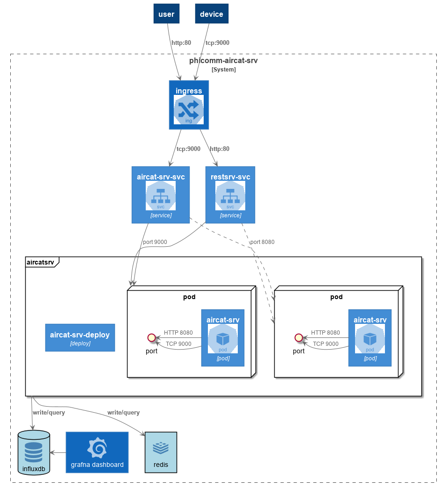

# aircat-srv-cluster

phicomm-aircat-srv cluster version for k8s

## Usage

```shell
usage: aircat-srv --influxdb-addr INFLUXDB_ADDRESS --redis-addr REDIS_ADDRESS [--cluster --redis-addr REDIS_ADDRESS]
  -alsologtostderr        log to standard error as well as files
  -cluster                run aircat-srv as cluster mode
  -influxdb-addr string   set influxdb server address (default "influxdb:8086")
  -logtostderr            log to standard error instead of files
  -redis-addr string      set redis server address (default "redis:6379")
  -init-delay int         initial delay, after redis/influxdb service ready.  
  -v value                log level for V logs (v=7,if debug)
```

## Design idea

1. listen at `:9000` for aircat device report measure

1. listen at `:8080` for RESTful API `http://:8080/v1/aircat/{mac}`

1. healthz API at `http://:8080/healthz`

1. aircat-srv store {mac,server_addr} in redis if aircat device report.

1. in cluster mode, aircat-srv redirect `PUT http://IP:8080/v1/aircat/{mac}` to server_addr if IP is not this host, which server_addr query by mac in redis.

architecture drawing as:  

